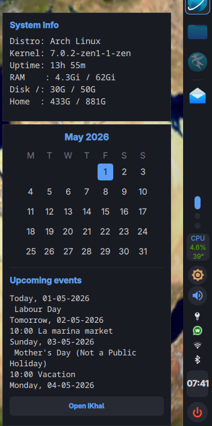
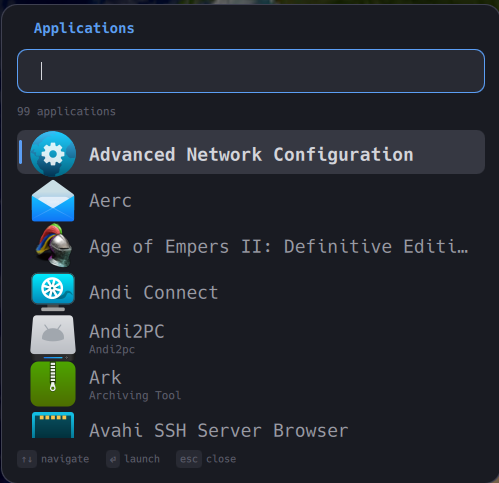

# Welcome to mi-shell
This is my version of a quickshell bar and tools.

It is vertical and for now there is no settings panel, everything is done via the config files. This may change over time but I am just setting this up for me. 

This started off as project to use something instead of the legacy Noctalia.

It ended up becoming a new system which is growing as I get the time. 

It has pinned apps with chosen icons, the icon lights up when in use and dims when closed. Running apps appear below. 


The pop out calendar links directly to khal and the system widget has information.





## What currently works

| Module | What it does |
|--------|-------------|
| **Bar** | clock, workspaces, pinned apps and running apps, volume, brightness, network, system tray, |
| **App Launcher** | rofi style application launcher |
| **Notifications** | mako-style notification daemon with popups |
| **OSD** | on-screen display for volume and brightness changes, auto-hides |
| **Theme Switcher** | 206 themes across 6 families, persists across restarts |
| **Wallpaper Manager** | grid picker for wallpapers, preview, swww |
| **Key Lock** | Number and caps lock on the bar |
| **Power Menu** | Shut down, reboot and logout from the bar |

## Dependencies

### Required
These will be installed automatically if you use the `PKGBUILD`:

* quickshell-git
* qt6-wayland
* qt6-svg
* niri
* polkit-gnome
* swww
* libnotify
* pipewire
* brightnessctl   
* khal
* networkmanager
* kitty
  

Optional

* bluetui: for the Bluetooth manager UI
* nmtui: for the Network manager UI
* floorp: for the browser shortcuts
* playerctl: recommended for better MPRIS control
* vdirsyncer: Optional: Only needed if you want to sync your local khal calendar with Google/CalDAV
* dolphin: Recommended file manager
* kate: Recommended text editor
* mpv: Recommended media player
* nerd-fonts-git: fonts used in notifications
  

## Installation

To install **mi-shell** on Arch Linux, use the provided `PKGBUILD`. This will automatically install all necessary dependencies (niri, swww, etc.).

1. Clone this repository.
2. Run `makepkg -si`.

### Niri Configuration
To start the shell and its helper services automatically, add the following lines to your `~/.config/niri/config.kdl`:


```kdl
# Authentication agent for password popups
spawn-at-startup "/usr/lib/polkit-gnome/polkit-gnome-authentication-agent-1"
spawn-at-startup "awww-daemon"

# Mi-shell components
spawn-at-startup "mi-sync"
spawn-at-startup "mi-power"
spawn-at-startup "quickshell" "-c" "mi-shell"
```

> **Note:** The `mi-shell` command ensures your local configuration directory exists at `~/.config/quickshell/mi-shell/`. The system-wide default configuration is installed at `/etc/xdg/quickshell/mi-shell/`.


Thanks to https://github.com/doannc2212/quickshell-config for the initial inspiration.
