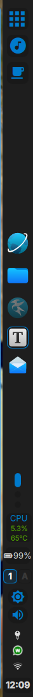
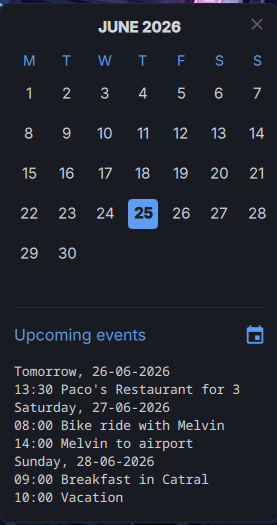
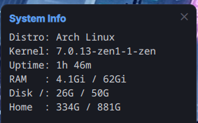
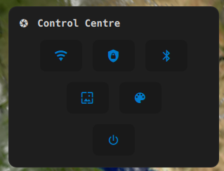
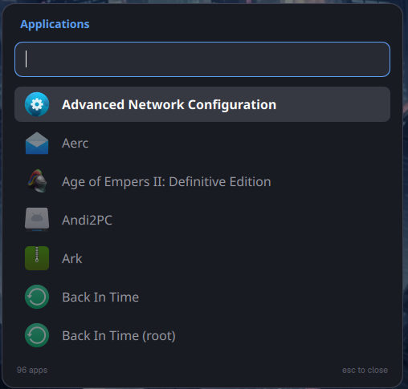
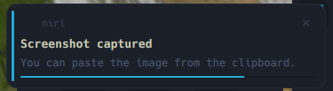
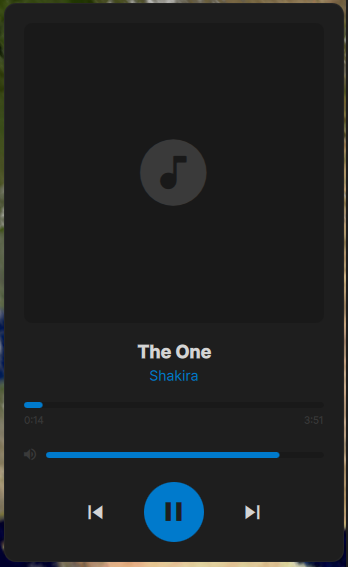

# Welcome to mi-shell
This is my version of a quickshell bar and tools.

It is vertical and for now there is no settings panel, everything is done via the config files. This may change over time but I am just setting this up for me. 

This started off as project to use something instead of the legacy Noctalia.

It ended up becoming a new system which is growing as I get the time. 

It has pinned apps with chosen icons, the icon lights up when in use and dims when closed. Running apps appear below. The top button opens the control panel, the next opens the media panel and the coffee cup lights up when the system is sleep inhibited. You can also click the cup to toggle the state.



The pop out calendar links directly to khal.





 and the system info has information about the distribution, kernel, uptime and disks.



The Control panel has easy access to networks, vpns, bluetooth, wallpaper, themes and session menu.



The launcher has a text filter and you can use the mouse.



The notifications are also theme aware.



There is a "sticky" media panel which sits next to the bar on top of other windows so you can control your media without changing workspace.



## What currently works

| Module | What it does |
|--------|-------------|
| **Bar** | clock, workspaces, pinned apps and running apps, volume, brightness, network, system tray, |
| **App Launcher** | rofi style application launcher |
| **Notifications** | mako-style notification daemon with popups |
| **OSD** | on-screen display for volume and brightness changes, auto-hides |
| **Theme Switcher** | 206 themes across 6 families, persists across restarts |
| **Wallpaper Manager** | grid picker for wallpapers, preview, swww |
| **Key Lock** | Number and caps lock on the bar |
| **Power Menu** | Shut down, reboot and logout from the bar |
| **Media Panel** | Shows current media playback with album art if available |

## Dependencies

### Required
These will be installed automatically if you use the `PKGBUILD`:

* quickshell-git
* qt6-wayland
* qt6-svg
* niri
* polkit-gnome
* swww
* swayidle
* swaylock
* libnotify
* pipewire
* brightnessctl
* khal
* networkmanager
* kitty
  

### Optional

* bluetui: for the Bluetooth manager UI
* nmtui: for the Network manager UI
* floorp: for the browser shortcuts
* playerctl: recommended for better MPRIS control
* vdirsyncer: Only needed if you want to sync your local khal calendar with Google/CalDAV
* dolphin: Recommended file manager
* kate: Recommended text editor
* mpv: Recommended media player
* nerd-fonts-git: fonts used in notifications
* Musikcube: Flawless music player with album art MPRIS connection

## Installation

To install **mi-shell** on Arch Linux, use the provided `PKGBUILD`. This will automatically install all necessary dependencies (niri, swww, etc.).

1. Clone this repository.
2. Run `makepkg -si`.

### Niri Configuration
To start the shell and its helper services automatically, a new file is created in  `~/.config/niri/mi-shell.kdl`:


```kdl
// --- MI-SHELL STARTUP ---
spawn-at-startup "/usr/lib/polkit-gnome/polkit-gnome-authentication-agent-1"
spawn-at-startup "awww-daemon"
spawn-at-startup "mi-power"
spawn-at-startup "quickshell" "-c" "mi-shell"

// --- Suggested Keybindings ---
binds {
    // Uncomment these to enable mi-shell shortcuts:
    // Mod+D { spawn "qs" "-c" "mi-shell" "ipc" "call" "launcher" "toggle"; }
    // Mod+S { spawn "mi-caffeine"; }
}
```

It also adds a line into ~/.config/niri/config.kdl

```// include "mi-shell.kdl"```

You just have to uncomment this and restart niri. 

The optional binds are also in the file but please check they do not clash with any existing ones. 

> **Note:** The `mi-shell` command ensures your local configuration directory exists at `~/.config/quickshell/mi-shell/`. The system-wide default configuration is installed at `/etc/xdg/quickshell/mi-shell/`.

You will also need to set something up as your secret tool, I use keepassxc as I got fed up with fighting with gnome-keyring and kwallet. 


Thanks to https://github.com/doannc2212/quickshell-config for the initial inspiration.
